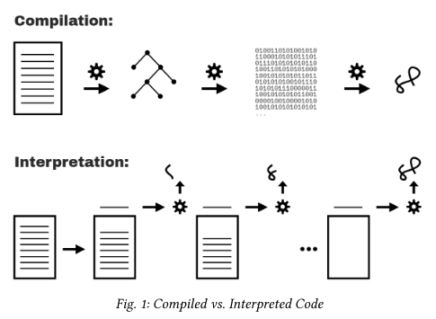
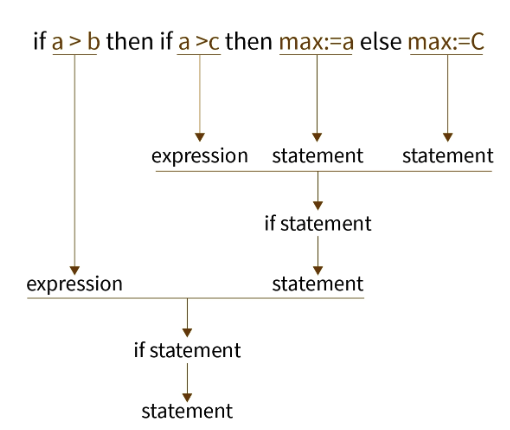

# You Don't know JS Yet - Book 2 - Scope & Clousures  

[Chapter 1 What's the Scope?](#chapter-1-what's-the-scope?)  

# Chapter 1 - What's the Scope?  


| Interpreter      | Compiler |
| ----------- | ----------- |
| Translates program one statement at a time.      | Scans the entire program and translates it as a whole into machine code. |
| Interpreters usually take less amount of time to analyze the source code. However, the overall execution time is comparatively slower than compilers. | Compilers usually take a large amount of time to analyze the source code. However, the overall execution time is comparatively faster than interpreters. |
| No Object Code is generated, hence are memory efficient.	| Generates Object Code which further requires linking, hence requires more memory. |
| Programming languages like JavaScript, Python, Ruby use interpreters.	| Programming languages like C, C++, Java use compilers. |  
  
  
**Scope is primarily determined during compilation**.  
In classic compiler theory, a program is processed by a compiler in three basic stages:  
1. **Tokenizing/Lexing**:  
Convert it:  
```
var a = 2;
```

To this:  
```
["var", "a", "=", "2", ";"]
```
**Tokenizer** is tool that converts human-readable text into a list of tokens for later processing.  

2. **Parsing**:
Taking a stream (array) of tokens and turning it into a tree of nested elements which collectively represent the grammatical structure of the program. This is called an *Abstract Syntax Tree (AST)*.  


3. **CodeGeneration**:  
Taking an AST and turning it into executable code.  
The JS engine takes the just described *AST* for `var a= 2;` and turns it into a set of machine instructions to actually `create` a variable called `a` (including reserving memory, etc.), and then store a value into `a`.  

## Cheating: Runtime Scope Modifications  
There are two techniques to modify the `scope` on runtime mode:  
- `eval`  
- `with`  
At all costs, avoid `eval(..)` (at least, eval(..) creating declarations) and `with`. Again, neither of these cheats is available in `strict-mode`, so if you just use `strict-mode` (you should!) then the temptation goes away!  

  
# Chapter 2: Illustrating Lexical Scope  
Imagine you come across a pile of marbles, and notice that all the marbles are colored red, blue, or green. Let’s sort all the marbles, dropping the red ones into a red bucket, green into agreen bucket, and blue into a blue bucket. After sorting, when you later need a green marble, you already know the greenbucket is where to go to get it.  

> In this metaphor, `the marbles are the variables` in our program. The `buckets are scopes` (functions and blocks), which we just conceptually assign individual colors for our discussion purposes. The color of each marble is thus determined by which color scope we find the marble originally created in.  

## Nested scope  
The `scope` is a policy that manages the availability of variables. A variable defined inside a `scope` is accessible only within that `scope`, but inaccessible outside.  

While `const` and `let` variables are scoped by code blocks, functions or modules, `var` variables are scoped only by functions or modules.  

Scopes can be `nested`. Inside an `inner scope` you can access the variables of an `outer scope`.

## Undefined Mess  
If the variable is a *source*, an unresolved identifier lookup is considered an *undeclared* (unknown, missing) variable, which always results in a `ReferenceError` being thrown. Also, if the variable is a *target*, and the code at that moment is running in `strict-mode`, the variable is considered undeclared and similarly throws a `ReferenceError`.  

The error message for an undeclared variable condition, in most JS environments, will look like, `Reference Error: XYZ isnot defined.` The phrase `not defined` seems almost identical to the word `undefined` as far as the English language goes. But these two are very different in JS, and this error message unfortunately creates a persistent confusion.  

> `Not defined` really means `not declared` —or, rather, `undeclared` as in a variable that has no matching formal declaration in any lexically available scope.  

> By contrast, `undefined` really means a variable was found (declared), but the variable otherwise has no other value in it at the moment, so it defaults to the undefined value.  

Example:  
```
var studentName;  
typeof studentName; // "undefined"   
typeof doesntExist; // "undefined"  
```


# Chapter 3: The Scope Chain  
Any reference to a variable that’s initially undeclared is left as an uncolored marble during that file’s compilation; this color cannot be determined until other relevant file(s) have been compiled and the application runtime commences. That deferred lookup will eventually resolve the color to which ever scope the variable is found in (likely the global scope).  

## Shadowing  
If you need to maintain two or more variables of the same name, you must use separate (often nested) scopes. And in that case, it’s very relevant how the different scope buckets are laid out:  

```
var studentName="Suzy";
function printStudent(studentName) {
    studentName=studentName.toUpperCase();
    console.log(studentName);
}

printStudent("Frank");// FRANK
printStudent(studentName);// SUZY
console.log(studentName);// Suzy
```

## Global Unshadowing Trick  
> **Please beware**: leveraging the technique I’m about to describe is not very good practice.  
It is possible to access a global variable from a scope where that variable has been shadowed, but not through a typical lexical identifier reference.  

```
var studentName="Suzy";  
function printStudent(studentName) {
    console.log(studentName);
    console.log(window.studentName);
}
printStudent("Frank");
// "Frank"
// "Suzy"
```

**Notice the `window.studentName` reference?** This expression is accessing the global variable `studentName` as a property on window (which we’re pretending for now is synonymous with the global object). That’s the only way to access a `shadowed` variable from inside a scope where the shadowing variable is present.  

## Arrow Functions  
**ES6** added an additional function expression form to the language, called `arrow functions`:  
```
var askQuestion = () => {
    // ..
};
```

> The => arrow function doesn’t require the word function to define it.  
> Arrow functions are lexically anonymous, meaning they have no directly related identifier that references the function.  


# Chapter 4: Around the Global Scope  
Javascript has 3 types of scopes:  
* Block scope  
* Function scope  
* Global scope  

The vast majority of work is now done inside of `functions` and `modules` rather than `globally`. Is it good enough to just assert, "Avoid using the global scope," and be done with it?  

A variable declared outside a function, becomes `GLOBAL`.  
```
let carName = "Volvo";
// code here can use carName

function myFunction() {
// code here can also use carName
}
```
Variables declared `Globally` (outside any function) have `Global Scope`.  

```
var studentName = "Kyle";
function hello() {
    console.log(`Hello,${window.studentName}!`);
}
window.hello(); // Hello, Kyle!
```

## Globals Shadowing Globals  
Where one variable declaration can override and prevent access to a declaration of the same name from an outer scope.  

> An unusual consequence of the difference between a global variable and a global property of the same name is that, within just the global scope itself, a global object property can beshadowed by a global variable:

```
window.something = 42;
let something = "Kyle";
console.log(something); // Kyle
console.log(window.something); // 42
```

The `let` declaration adds a `something` global variable but not a global object property. The effect then is that the something lexical identifier shadows the `something` global object property.

## Webworkers  
Web Workers are a simple means for web content to run scripts in background threads. The worker thread can perform tasks without interfering with the user interface.   

For a more detailed explanation you can visit the next link: [Webworkers](https://developer.mozilla.org/en-US/docs/Web/API/Web_Workers_API/Using_web_workers)  

## Global **this**    
A program may or may not:  
- Declare a global variable at top-level with `var` or `functions` declarations or `let`, `const` and `class`.  
- Add global variables as properties of the `global scope` if `var` or `function` are used for the declaration.  
- Refer top the `global scope` with `window`, `self` or `global`.  

That's a lot of different ways to try to get at this `global object`.  
**Each has its *pros* and *cons*.**  

# Chapter 5: The (Not So) Secret Lifecycle of Variables  
What happens if you try to declare the same variable twice in a scope?  

There may seem to be an obvious answer: **after the variable has been declared/created**.  
Right? Not quite.  

```
greeting();   
// Hello!  
function greeting() {  
    console.log("Hello!");  
}
```
The term most commonly used for a variable being visible from the beginning of its enclosing scope, even though its declaration may appear further down in the scope, is called `hoisting`.  
But hoisting alone doesn't fully answer the question. We can see an identifier called `greeting` from the beginning of the scope, but why can we call the `greeting()` function before it's been declared?  

In other words, how does the variable `greeting` have any value (the function reference) assigned to it, from the moment the scope starts running? The answer is a special characteristic of formal function declarations, called `function hoisting`.    
> When a function declaration's name identifier is registered at the top of its scope, it's additionally autoinitialized to that function's reference. That's why the function can be called throughout the entire scope!  

## Hoisting: Declaration vs. Expression  
- Variables declared with `var` are also automatically initialized to `undefined`.  

```
greeting();   
// TypeError  
var greeting = function greeting() {  
    console.log("Hello!");  
}
```

A `TypeError` means we're trying to do something with a value that is not allowed.  

> Only functions can be invoked, so attempting to invoke some non-function value results in an error.  

### Variable hoisting  
```
greeting = "Hello!";   
console.log(greeting);// Hello!  
var greeting = "Howdy!";  
```

Though `greeting` isn't declared until line 3, it's available to be assigned to as early as line 1.  
Why? There's two necessary parts to the explanation:    
1. The identifier is hoisted  
2. and it's automatically initialized to the value `undefined` from the top of the scope.    

### Re-declaration?  
What do you think happens when a variable is declared more than once in the same scope? Consider:  
```
var studentName = "Frank";  
console.log(studentName);// Frank   
var studentName;  
console.log(studentName);// ???  
```

> JS doesn't really want us to "re-declare" our variables within the same scope.  

### Uninitialized Variables (aka, TDZ)
With `var` declarations, the variable is `hoisted` to the top of its scope. But it's also automatically initialized to the `undefined` value, so that the variable can be used throughout the entire scope.   
However, `let` and `const` declarations are not quite the same in this respect.  

In short:  
**Hosinting:**  
`let`, `const`, `var` are all get hoisted process: Whats mean they go upper and declare in the top of the scope.  

**Initialisation:**  
`var` go also through the initial process, and get initial value of `undefined`.  
`let` and `const` didn't go throw the initial process, so their values are still inaccessible, although they already declared. What's put them in `temporal dead zone`.  
```
let sum = a + 5;        //---------
//some other code       //         | ------>  this is TDZ for variable "a"
//         |
console.log(sum)        //---------
let a = 5;
```

# Chapter 6: Limiting Scope Exposure  
**POLP (Principle of Least Privilege)** expresses a defensive posture to software architecture:   
components of the system should be designed to function with `least privilege`, `least access`, `least exposure`.    
If each pie is connected with minimum-necessary capabilities, the over-all system is stronger from a security standpoint, because a compromise or failure of one piece has a minimized impact on the rest of the system.  
  
**POLE (Least Exposure)**  as applied to variable/function scoping, essentially says, default to exposing the bare minimum necessary, keeping everything else as private as possible. Declare variables in as small and deeply nested of scopes as possible, rather than placing everything in the global (or even outer function) scope.   

> If `POLP` focuses on system-level component design, the `POLE Exposure` variant focuses on a lower level; we'll apply it to how scopes interact with each other.  

In the next code, the POLE principle is applied:
```
function diff(x,y) {
    if(x>y) {
        let tmp=x; 
        x=y;
        y=tmp;
    } 
    return y-x;
 }
 
 diff(3,7);// 4
 diff(7,5);// 2
 ```
As we can see, `temp` var is "hidden" is `scope` as possible.   

## Scoping with Blocks  
In general, any `{ .. }` curly-brace pair which is a statement will act as a block, but not necessarily as a scope.  
```
{
    // not necessarily a scope (yet)
    // ..    
    // now we know the block needs to be a scope
    let thisIsNowAScope = true;
    for(leti=0; i<5; i++) {
        // this is also a scope, activated each
        // iteration
        if(i%2==0) {
            // this is just a block, not a scope
            console.log(i);
        }
    }
}
// 0 2 4
```

Another example:  
```
if(somethingHappened) {
    // this is a block, but not a scope
    {
        // this is both a block and an
        // explicit scope
        let msg = somethingHappened.message();
        notifyOthers(msg);
    }
    // ..recoverFromSomething();
}
```

In the next example, `tmp` is a `function scoped` non a `block scoped`:  
```
function diff(x,y) {
  if(x>y) {
    var tmp=x;// `tmp` is function-scoped
    x=y;
    y=tmp;
  }
  console.log(tmp);
  return y-x;
}

diff(3,2);
```

But, is `tmp` were declared as `let`, then this variable were a `block scoped`.  

## Where to `let`?  
The way to decide is not based on which keyword you want to use.   
The way to decide is to ask, **"What is the most minimal scope exposure that's sufficient for this variable?"**  

## What's the Catch?  
Since the introduction of `try..catch` back in ES3 (in 1999), the `catch` clause has used an additional (little-known) block-scoping declaration capability:  
```
try {
    doesntExist();
}catch(err) {
    console.log(err);
    // ReferenceError: 'doesntExist' is not defined
    // ^^^^ message printed from the caught exception
    let onlyHere = true;
    var outerVariable = true;
}
console.log(outerVariable);  // true
console.log(err);  // ReferenceError: 'err' is not defined
// ^^^^ this is another thrown (uncaught) exception

> The `err` variable declared by the `catch` clause is block-scoped to that block.
```

## Functions declarations in Blocks (FiB)  
We've seen now that declarations using `let` or `const` are `block scoped`, and `var` declarations are `function scoped`.  
> As far as I'm concerned, the only practical answer to avoiding the vagaries of FiB is to simply avoid FiB entirely.  


# Chapter 7: Using Closures  
