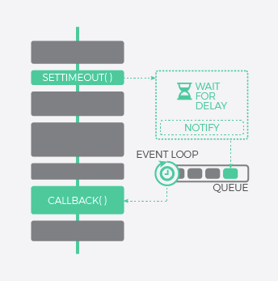
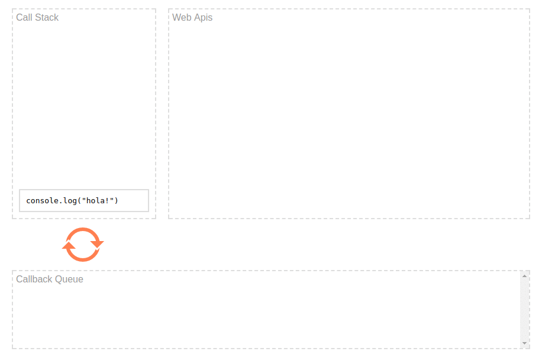

# Asynchronous JavaScript Deep Dive 

## Understanding Asyncronous Coding  
Basically the way syncronous code works is one piece of code executes and must finish before the next piece of code can start and so it goes in order.

```
use 'strict';

const test = function(){
    console.log("Start of code");
    alert("Notice Me!");
    console.log("End of code");
}

const test2 = function(){
    console.log("Now I get attention.");
}

test();
test2();
```

Asyncronous can be explained like this:  

1. Request I/O, the code can continue the process.  
2. A change of context is applied, the real operation occurs out of our application.  
3. The request is pulled into the queue of processs pending to be processed.  
4. The event loop process every request.  
5. When the request is processed the function associated with him (callback) is scheduled to be executed. The callback will do the specified tasks on it. 


## Advantages vs Disadvantages  
### Syncronous
**Advantages**  
Easy to write.   
**Disadvantages**  
May create blocking code.  
Less performant.  

### Asyncronous
**Advantages**  
Very performant.  
Eliminates code blocking.  
**Disadvantages**  
???????? It can be difficult to reason about.    
Harder to write.  

## Event Loop  
In the next code, we can see an example of how the ´event loop´ works.  
```  
console.log(“hola”);  
setTimeout(function timeoutCallback() {  
    console.log(“mundo”);  
}, 500);  
console.log(“Ubykuo, everytime, everywhere”);  

//Results:  
// => hola  
// => Ubykuo, everytime, everywhere  
// => mundo  
```  
As we can see, JS has only one `thread` and events like `setTimeout`, `DOM` and `HTTP` request are not executed by JS.  
These are called `Web API` and are executed by the browser in another `thread`, for that reason, JS can execute multiple tasks without stop the sequential process.


## Callbacks  
Code in JS runs sequentially, this is synchronous, but sometimes is beneficial to have code execute asynchronously.  
This is called `callbacks`.   
**Example 1**
```
let logCall = function(){
    console.log("logCall was called back");
};
setTimeout(logCall, 3000);
```

**Example 2**  
Callback with an anonymous function, **this is the standard**.
```
setTimeout(function(){
    console.log("The function was called back");
}, 3000);
```

The better way of using `callbacks` is on `event listeners`: **you don't want something happen until an event occurs**.
### The problems with CALLBACKS  
1. *Callback hell*: When you have nested callbacks.    
2. *Difficult to reason about*: Two or more callback acting on same state.  
3. *Inversion of control*  

That's why `PROMISES` help you to solve these problems.

# Promises  
Promises provide a powerful async pattern in Javascript. Many API's make use of promise.  
Promise are:
- An object with Properties and Methods.  
- Represents the Eventual Completion (or Fairlure) of an Asyncronous Operation.  
- Provides a resulting value.  

Example of a Promise:
```
let asyncFunction = function(){
    return new Promise(function(resolve, reject){
        setTimeout(function(){
            resolve("asyncFunction has resolved.")
        }, 4000);
    });
};

let promise = asyncFunction();
promise.then(function(val){
    console.log("It's done!!!"+val+ ' ');
});

console.log("The code is asynchronous.");
```

On the console we can see:  
**First:** `The code is asynchronous.`    
**Second:** `It's done!!! asyncFunction has resolved.`  

This why the promise has a `setTimeout` of 4 seconds later but the process continues while the promise is resolved.  

The next is an example of code which execute a promise:  
```
let asyncFunction = function(){
    return new Promise(function(resolve, reject){
        setTimeout(function(){
            resolve("asyncFunction has resolved.")
        }, 4000);
    });
    };

let asyncFunction2 = function(){
    return new Promise(function(resolve, reject){
        setTimeout(function(){
            resolve("asyncFunction2 has resolved.")
        }, 3000);
    });
};
    
let promise = asyncFunction();
let promise2 = promise.then(function(val){
    console.log("Yeah!, " + val);
    return asyncFunction2();
});
promise2.then(function(val){
    console.log("Second promise: "+val);
});

console.log("The code is asynchronous.");
``` 

As you can see, the structure is not clear.  
```
let asyncFunction = function(){
    return new Promise(function(resolve, reject){
        setTimeout(function(){
            resolve("asyncFunction has resolved.")
        }, 4000);
    });
    };

let asyncFunction2 = function(){
    return new Promise(function(resolve, reject){
        setTimeout(function(){
            resolve("asyncFunction2 has resolved.")
        }, 3000);
    });
};
```
We'll do some adjusts to chain both promises:
```
asyncFunction.promise
    .then(function(val){
        console.log("Yeah!, " + val);
        return asyncFunction2();
    })
    .then(function(val){
    console.log("Second promise: "+val);
});

console.log("The code is asynchronous.");
```
Now, this example is more clear.

Example of JSON Placeholder POST:  
```
"use strict";
//POST example
let todo = {
completed: false,
userId: 1,
title: "Learn Promises"
}

fetch("https://jsonplaceholder.typicode.com/todos/", {
method: "POST",
headers: {
"Content-type": "application/json"
},
body: JSON.stringify(todo)
})
.then(response => response.json())
.then(data => console.log(data))
.catch(error => {
console.log(`Hubo un error: ${error}`);
});
```

Using `finally` to execute code everytime a `promise` is executed:  
```
let asyncFunction = function(){
    return new Promise(function(resolve, reject){
       setTimeout(function(){
          resolve("asyncFunction has resolved.")
       }, 4000);
    });
  };
  
asyncFunction()
    .then(msg => console.log(msg))
    .catch(err => console.log(err))
    .finally(() => console.log("asyncFunction has finished."));
```

Example of using `promise.all` to execute promises. It's important notice which these promises will be executed one by one in the order that were settled. In this example, `firstName` will be the first promise to be executed, later `lastName` and finally `middleName`.  

> This method `promise.all`  returns a promise and will be `fullfilled` once all promises on array are `fulfilled`.

```
Promise
    .all([firstName, lastName, middleName])
    .then(function (values) {
        console.log(values);
    });

var MAINAPP = (function(nsp) {
    "use strict";

    let url = "https://jsonplaceholder.typicode.com/";

    let p1 = fetch(url + "posts/").then(response1 => response1.json()),
        p2 = fetch(url + "comments/").then(response2 => response2.json()),
        p3 = fetch(url + "todos/").then(response3 => response3.json());

    Promise.all([p1,p2,p3])
        .then(msg => {
            nsp.posts = msg[0];
            nsp.comments = msg[1];
            nsp.todos = msg[2];
            console.log("We have received tha data!");
        })
        .catch(err => console.log(`Problem retrieving promise TODOS ${err}`));        

    return nsp;
})(MAINAPP || {});
```

### Promise allSettled  
The `Promise.allSettled()` method returns a promise that resolves after all of the given promises have either fulfilled or rejected, with an array of objects that each describes the outcome of each promise.  

It is typically used when you have multiple asynchronous tasks that are not dependent on one another to complete successfully, or you'd always like to know the result of each promise.  

```
const promise1 = Promise.resolve(3);  
const promise2 = new Promise((resolve, reject) => setTimeout(reject, 100, 'foo'));  
const promises = [promise1, promise2];  

Promise.allSettled(promises).  
  then((results) => results.forEach((result) => console.log(result.status)));  

// expected output:  
// "fulfilled"  
// "rejected"  
```

> In other words, `allSettled()` will never **rejects**. It will resolve once **all Promises** in the array have either `rejected` or `resolved`.  

### Promise all  
> Will reject as `soon as one` of the Promises in the array is **rejected**.  

### Promise race  
> It's `resolved` when any promise is `resolved` or `rejected`.    

### Promise any
> Continue the code when any promise is `resolved` or is `rejected` when **all promises are rejected**.    

# Async/Await  
Basically `Async/Await` extends the funcionallity of `promises`.  The main purpose of `Async/Await` is simplify the the `promise` code.  

Important notes about `await`:  
- It only can be used inside an `async` function  
- It waits for a `promise`  
- It causes the `async` function to pause  

# Generators Functions  
A generator is a special function which can pause the execution code and pick it up in another point of the code.  
Two reserved words are used: ´function*´ and ´yield´.  


